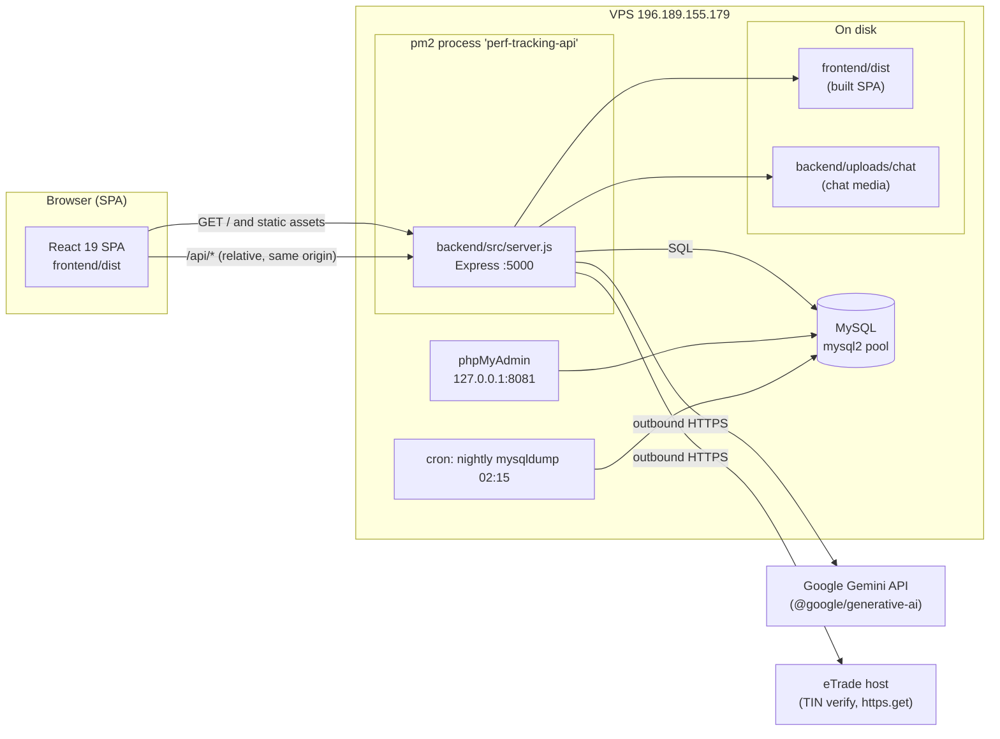
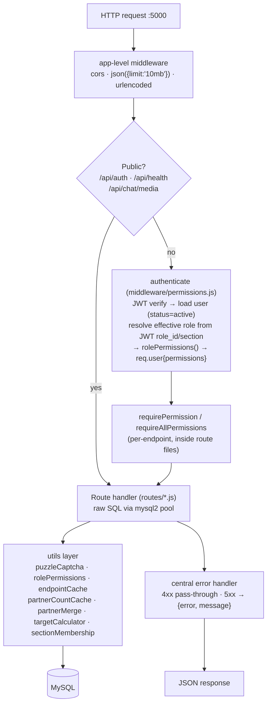
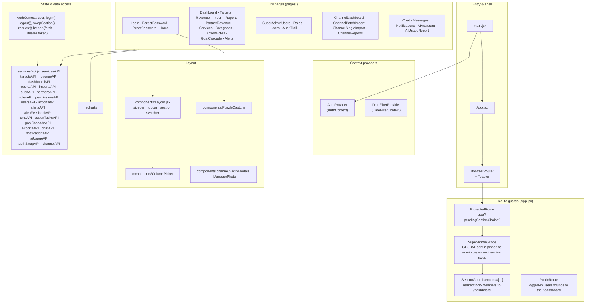
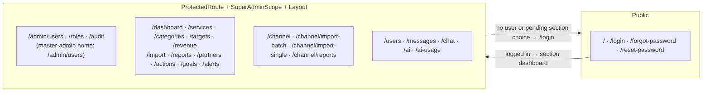
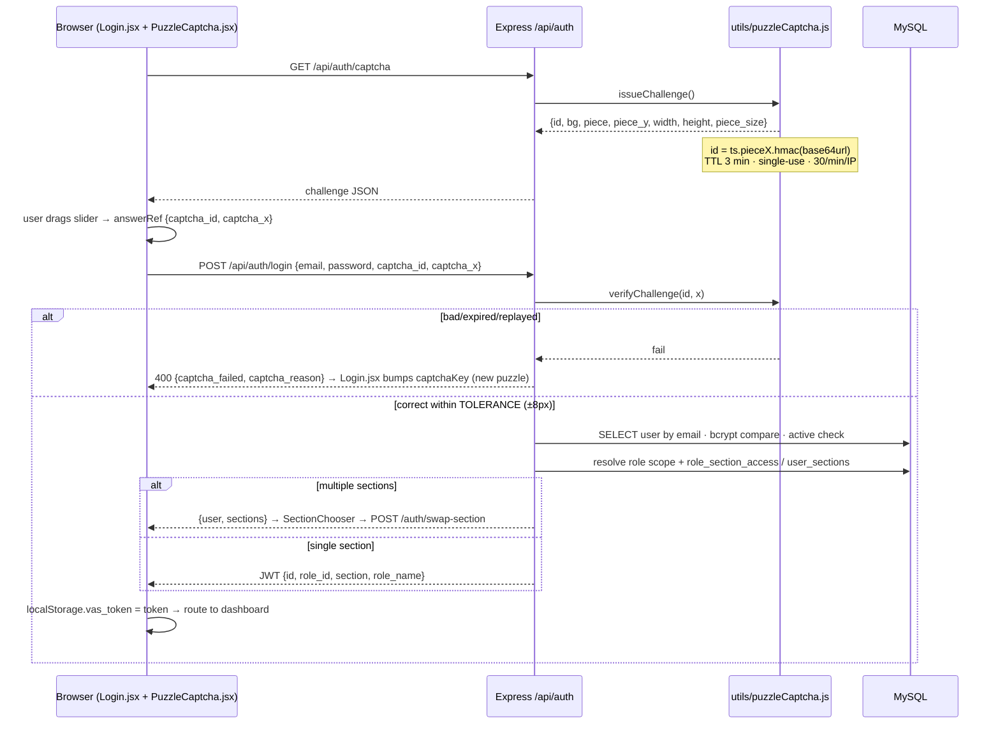

# Code Architecture — VAS Performance Tracking System

> Single-repo monorepo: `backend/` (Express + MySQL, CommonJS) and `frontend/` (React 19 + Vite + Tailwind v4).
> Production = one Node process on port 5000 serving both the API and the built SPA. Docs-only file — no runtime impact.

---

## 1. High-level system & deployment topology

The whole system runs on a single VPS. Nginx terminates other sites on 80/443 but the app itself is reached
directly on port 5000 through pm2. phpMyAdmin is bound to localhost only (tunnel access).



Key properties:

- **One port, one process** — the SPA calls `/api/...` relatively, so Express serves static `frontend/dist` and the
  catch-all `GET *` falls back to `index.html` (SPA deep-link support). No separate web server in production.
- **pm2 name** `perf-tracking-api` runs `backend/src/server.js` with `PORT=5000`.
- **No ORM** — route modules write raw SQL via a shared `mysql2/promise` pool.

---

## 2. Repository layout

```
targettracking/
├── backend/
│   ├── package.json            # express, mysql2, jsonwebtoken, bcryptjs, multer, xlsx,
│   │                           # pptxgenjs, pdfkit, @google/generative-ai, undici, uuid
│   ├── uploads/chat/           # chat media (served publicly at /api/chat/media)
│   └── src/
│       ├── server.js           # ENTRY: middleware, mounts all 26 route modules, static+SPA
│       │                       # fallback, error handler, post-boot cache pre-warm
│       ├── env.js              # loads .env
│       ├── pptFooter.js        # pptx helpers (exports)
│       ├── pptxMerge.js        # pptx helpers (exports)
│       ├── config/             # database.js (pool) + one-off DB setup/migration scripts
│       ├── middleware/
│       │   ├── permissions.js  # LIVE auth: authenticate / requirePermission /
│       │   │                   #   requireAllPermissions / isMasterAdmin / sectionScope
│       │   └── auth.js         # LEGACY auth middleware (JWT-only; not mounted)
│       ├── routes/             # 26 route modules (business logic lives here, no controllers/)
│       └── utils/              # captcha, permissions resolver, caches, calculators
├── frontend/
│   ├── package.json            # react 19, react-router-dom 7, recharts, lucide-react,
│   │                           # react-hot-toast, date-fns; dev: vite 5, tailwind v4, oxlint
│   ├── vite.config.js          # dev server :3001, proxies /api -> localhost:5000
│   └── src/
│       ├── main.jsx            # React root
│       ├── App.jsx             # router + route guards (see §5)
│       ├── index.css           # Tailwind v4 @theme, green palette, login animations
│       ├── components/         # Layout (app shell), PuzzleCaptcha, ColumnPicker, channel/*
│       ├── context/            # AuthContext (auth+request), DateFilterContext
│       ├── pages/              # 28 screens
│       ├── services/api.js     # request() + typed API client per backend namespace
│       └── utils/              # helpers, dateFilter, chatSounds, verifyChoices
└── scripts/                    # ops docs (DATABASE-SECURITY.md), SQL audits, this file
```

Notable structure facts:

- **No `controllers/` and no `models/`** — handlers and SQL live directly in `routes/*.js` (the two empty dirs
  are placeholders).
- **Two auth middlewares exist**; only `middleware/permissions.js` is mounted in `server.js`. `middleware/auth.js`
  is dead code kept from an earlier iteration.
- `config/` mixes the live DB pool (`database.js`) with idempotent setup scripts (`dbSetup.js`, `channelDbSetup.js`,
  `addMultiSectionScope.js`, …) run manually via `npm run db:*`.

---

## 3. Backend architecture

### 3.1 Module map (server.js mounts)

| Mount | Module | Responsibility |
|---|---|---|
| `/api/auth` | `routes/auth.js` | login (+ puzzle captcha gate), me, change-password, forgot/reset-password, avatar, **swap-section** |
| `/api/health` | inline | liveness probe |
| `/api/chat/media` | express.static | public chat media (unguessable filenames) |
| `/api/services` | `routes/services.js` | VAS service catalog (permission-guarded) |
| `/api/targets` | `routes/targets.js` | revenue targets + month allocations (`utils/targetCalculator.js`) |
| `/api/revenue` | `routes/revenue.js` | revenue CRUD, audit-logged |
| `/api/reports` | `routes/reports.js` | performance / trend reports |
| `/api/dashboard` | `routes/dashboard.js` | KPIs, service achievement, category breakdown, MoM growth |
| `/api/imports` | `routes/imports.js` | Excel import preview → confirm (xlsx), batches |
| `/api/partners` | `routes/partners.js` | partner revenue datasets, fuzzy merge cache |
| `/api/actions` | `routes/actions.js` | action notes, history, replies |
| `/api/action-tasks` | `routes/actionTasks.js` | tasks under actions |
| `/api/goal-cascade` | `routes/goalCascade.js` | goal cascades + items, auto-generate |
| `/api/categories` | `routes/categories.js` | categories (permission-guarded) |
| `/api/roles` | `routes/roles.js` | roles, permissions assignment, section access |
| `/api/permissions` | `routes/permissions.js` | permission catalog CRUD |
| `/api/users` | `routes/users.js` | user admin + per-section assignments |
| `/api/audit` | `routes/audit.js` | audit trail (section-filtered) |
| `/api/alerts` | `routes/alerts.js` | target achievement alerts |
| `/api/alert-feedback` | `routes/alertFeedback.js` | feedback, reactions, replies |
| `/api/sms` | `routes/sms.js` | SMS log / send / import-and-send |
| `/api/chat` | `routes/chat.js` | DMs, groups, typing, media upload |
| `/api/notifications` | `routes/notifications.js` | per-user notifications |
| `/api/exports` | `routes/exports.js` | PPTX (pptxgenjs) / PDF (pdfkit) report exports |
| `/api/ai` | `routes/ai.js` | Gemini assistant, usage tracking, daily quotas |
| `/api/channel` + `/api/channel/imports` | `routes/channel.js`, `routes/channelImports.js` | Indirect Channel: entities, TIN verify (eTrade), photos, imports, reports |

Every route module except `auth`, `health` and `chat/media` sits behind the shared `authenticate` middleware
mounted in `server.js`.

### 3.2 Request pipeline



- `authenticate` is **DB-backed**: every request re-reads the user and re-resolves permissions, so role changes
  and deactivations take effect without waiting for token expiry. The JWT carries `role_id` + `section`, which
  pick the *effective* role (section-swap aware).
- Permission checks are allow-list style: `requirePermission('x','y')` passes if the user holds **any** listed name;
  `requireAllPermissions` requires all.

### 3.3 Utils layer

| Module | Purpose |
|---|---|
| `utils/puzzleCaptcha.js` | Slider puzzle captcha: canvas 240×160, 52px piece, HMAC-signed id (`ts.x.hmac`), 3-min TTL, single-use, 30/min per-IP rate limit. Used by `/api/auth/captcha` + login gate |
| `utils/rolePermissions.js` | Resolves role → permission rows, MULTI_SECTION narrowing by token section |
| `utils/sectionMembership.js` | SQL fragments for cross-section visibility rules (chat, audit) |
| `utils/endpointCache.js` | In-memory response cache used by heavy report/dashboard endpoints |
| `utils/partnerCountCache.js` | Warmed partner aggregates (pre-warmed at boot in `server.js`) |
| `utils/partnerMerge.js` | Fuzzy merge of partner name variants |
| `utils/targetCalculator.js` | Target allocation math + `revenue_target_allocations` table |

### 3.4 Config layer

- `config/database.js` — the single `mysql2` pool (connectionLimit 10, keep-alive). Everything imports this.
- The rest of `config/` are **idempotent setup/migration scripts** (run manually, `npm run db:*`):
  `dbSetup.js` (core VAS schema), `channelDbSetup.js` (channel schema), `simplifiedImport.js`,
  `may2026Setup.js`, `addIndexes.js`, `addScopeColumns.js`, `addMultiSectionScope.js`,
  `addSectionSwapPermission.js`, `addChatPermissions.js`, `addChannelEditPermissions.js`,
  `ensureAdminPermissions.js`. Several route files also self-heal their own tables at boot
  (`ensureTable()` pattern in `actions.js`, `actionTasks.js`, `goalCascade.js`, `notifications.js`, `ai.js`).

---

## 4. Frontend architecture



- **Data flow:** pages call typed `*API` objects in `services/api.js`; everything goes through one `request()`
  helper that attaches `Authorization: Bearer <token>` from `localStorage.vas_token` and throws on `!ok`.
  Contexts: `AuthContext` (session + section state, also exports `request` and `isMasterAdminRole`),
  `DateFilterContext` (global date range feeding dashboards/reports).
- **Dev mode:** Vite dev server on :3001 proxies `/api` → `localhost:5000`, so the same relative-path code runs in
  dev and prod. `npm run build` → `frontend/dist` served by Express.
- **Two section domains:** VAS routes under `/dashboard`, `/targets`, … and Indirect Channel routes under `/channel*`,
  gated by `SectionGuard` + backend `sectionScope`.

---

## 5. Routing & guards (App.jsx)



Guard semantics:

- **ProtectedRoute** — redirects to `/login` when there is no user or a section choice is still pending
  (deep links can't skip section selection).
- **SuperAdminScope** — a GLOBAL-scope master admin with `user.section === null` is pinned to `/admin/users`,
  `/roles`, `/audit` until they swap into a section.
- **SectionGuard** — restricts routes to listed sections; master admin / cross-section users pass.
- **PublicRoute** — logged-in users are redirected to `/admin/users`, `/channel`, or `/dashboard` by role/section.
- After login, if a user belongs to multiple sections, `Login.jsx` renders **SectionChooser** and calls
  `swapSection()` before entering the app.

---

## 6. Security architecture — login + captcha



Defense layers around auth: puzzle captcha before any DB/bcrypt work, JWT Bearer on every API call,
per-request permission re-resolution, audit-trail inserts on sensitive actions (`auth.js`, `imports.js`,
`revenue.js` write to `audit_trail`), and section confinement on both UI (`SectionGuard`) and API
(`sectionScope()`).

---

## 7. Data model (MySQL)

Schema lives in `config/dbSetup.js` (VAS), `config/channelDbSetup.js` (Indirect Channel) plus `ensureTable()`
self-healing in route files. Grouped by domain:

```mermaid
erDiagram
    users ||--o{ user_sections : "per-section roles"
    users }o--|| roles : "default role_id"
    roles ||--o{ role_permissions : ""
    permissions ||--o{ role_permissions : ""
    roles ||--o{ role_section_access : "swappable sections"
    users ||--o{ audit_trail : "user_name"
    users ||--o{ chat_messages : "sender/receiver"
    users ||--o{ notifications : ""
    users ||--o{ ai_usage : ""

    vas_services ||--o{ revenue_targets : "service_id"
    vas_services ||--o{ vas_service_types : "type"
    vas_services ||--o{ vas_categories : ""
    revenue_targets ||--o{ revenue_target_allocations : "target_id"
    partner_revenue }o--|| import_batches : "import_batch_id"
    vas_services ||--o{ action_notes : "service_name ref"
    action_notes ||--o{ action_tasks : ""
    action_notes ||--o{ action_history : ""
    action_notes ||--o{ action_replies : ""
    goal_cascades ||--o{ goal_cascade_items : ""
    users ||--o{ alert_feedback : "created_by"

    channel_domains ||--o{ channel_categories : ""
    channel_categories ||--o{ channel_entities : "category/level"
    channel_entities ||--o{ channel_stock_balances : ""
    channel_categories ||--o{ channel_stock_summary : ""
    channel_import_batches ||--o{ channel_import_rows : "batch_id"
    channel_import_batches ||--o{ channel_import_errors : "batch_id"
    channel_entities ||--o| channel_manager_photos : "via TIN"
    channel_category_aliases {
        varchar raw_value
    }
    channel_geo_aliases {
        varchar raw_value
    }
    kpi_snapshots {
        date snapshot_date
    }
    sms_messages {
        varchar recipient
    }
    chat_messages {
        int sender_id
        int group_id
    }
    chat_groups ||--o{ chat_group_members : ""
    chat_groups ||--o{ chat_messages : "group_id"
    permissions {
        varchar name
        varchar module
        varchar action
    }
    import_batches {
        varchar36 id
    }
```



Highlights:

- **RBAC core:** `users` → `roles` (with `scope` ∈ GLOBAL / MULTI_SECTION / single) → `permissions` via
  `role_permissions`; `user_sections` assigns per-section roles; `role_section_access` lists which sections a role
  may swap into; every sensitive action lands in `audit_trail`.
- **Revenue core:** `vas_services` + `vas_service_types` + `vas_categories` define the catalog; `revenue_targets`
  (+ `revenue_target_allocations`) hold goals; actuals arrive via Excel into `partner_revenue` (tracked in
  `import_batches`); `kpi_snapshots` keeps dashboard history.
- **Indirect Channel** is a parallel schema (separate tables + `/api/channel` namespace): `channel_entities`
  (keyed by mobile), domains/categories/aliases, stock balances/summary, import batches/rows/errors, and
  `channel_manager_photos` keyed by TIN (fetched from the external eTrade TIN service).

---

## 8. Build & run

| Concern | Value |
|---|---|
| Backend dev | `npm run dev` (nodemon) — port 5000 |
| Frontend dev | `npm run dev` (Vite :3001, `/api` proxied to :5000) |
| Frontend build | `npx vite build` → `frontend/dist` (served by Express when present) |
| Production | pm2 `perf-tracking-api` → `backend/src/server.js`, `PORT=5000`, serves `frontend/dist` |
| DB setup scripts | `npm run db:setup`, `db:admin-perms`, `db:chat-perms`, `db:channel-edit-perms`, `db:multi-section-scope` |
| Deploy (VPS) | tar `frontend/dist` + changed backend files → scp → extract under `/var/www/performancetracking/app` → `pm2 restart perf-tracking-api` |
| Health | `GET /api/health` → `{status:'ok'}` |
| Lint | `npm run lint` (oxlint) — frontend only; backend checked with `node --check` |
| Tests | none in repo (0 test files) |

External services the backend talks to: **Google Gemini** (`routes/ai.js`, keys via env, optional undici proxy)
and the **eTrade TIN-verify host** (`routes/channel.js`, `https.get` with Referer/Origin headers).
